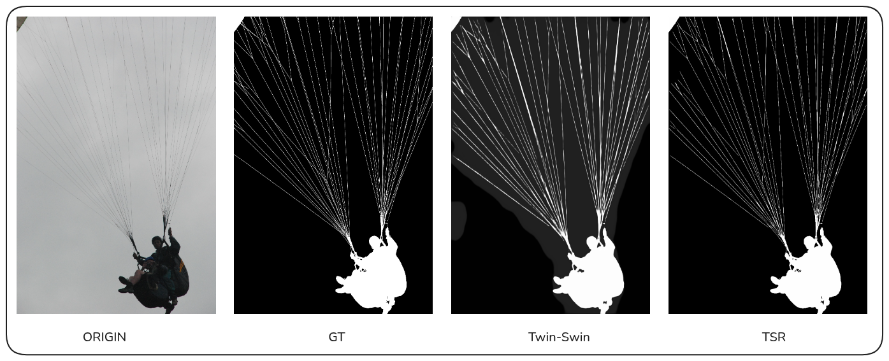
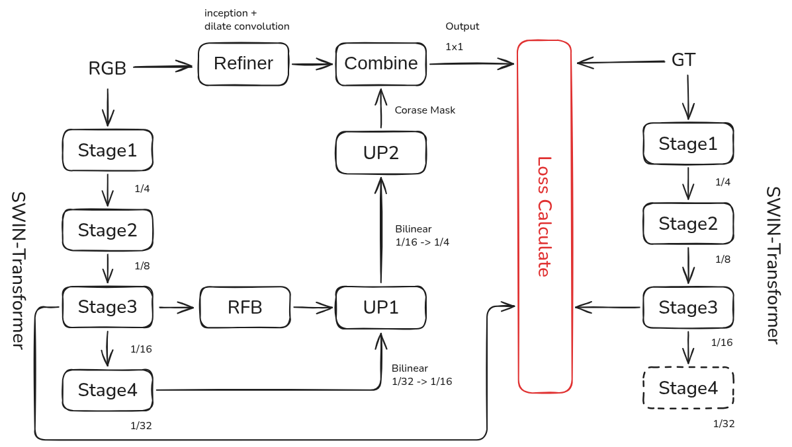

# TSR-Matte: Twin Swin Refiner for High-Resolution Image Matting

[](https://pytorch.org/)
[](LICENSE)
[]()

**TSR-Matte** is a high-performance image matting architecture designed to handle high-resolution inputs with precise edge details. By synergizing the global semantic power of **Swin Transformers** with a novel **Residual Refinement Module (RRM)**, TSR-Matte achieves SOTA-level performance (SAD ~31.4 on DIS5K) without relying on traditional morphological dilation.

> **Key Insight**: We demonstrate that "Uncertainty Halos" are not noise to be removed by dilation, but valuable "soft cues" for a dedicated Refiner to carve out pixel-perfect hair details.

---
### 🔬 Visual Analysis & Insights

Why does TSR-Matte outperform traditional methods? We analyzed the behavior of three different strategies:

| Strategy | Configuration | Observation | Analysis |
| :--- | :--- | :--- | :--- |
| **1. Baseline** | Swin-Only | **Uncertainty Fog**. Correct shape but surrounded by a wide, gray halo. | The Transformer lacks local precision, outputting "safe" blurry edges to minimize variance. |
| **2. Brute Force** | w/ Dilation | **Jagged Edges**. No halo, but hair details are destroyed. | Dilation forces the model to overfit to a binary mask, killing the natural alpha transparency. |
| **3. TSR-Matte** | **Twin + Refiner** | **Pixel-Perfect**. Sharp edges with natural anti-aliasing. | The **Twin-Encoder** fixes the structure, and the **Refiner** uses the gradient map to resolve the micro-details. |



---
### 💡 The "MSE Dilution Effect"
Why do we need a Refiner when MSE improvements seem small?
* **The Trap**: MSE calculates error across millions of pixels. Since 95% of the image (pure background/foreground) is easy, a model can get a great MSE score just by being "safe" and blurry.
* **The Solution**: A 0.002 difference in MSE often represents a **massive visual improvement** in the critical 5% edge regions. TSR-Matte prioritizes **Perceptual Quality** over numerical safety, forcing sharp, high-frequency details that the human eye appreciates.

---
### 🚀 Key Features

1.  **Twin-Encoder Architecture (The Student)**
    * **Backbone**: Swin Transformer (Tiny/Base).
    * **Distillation**: A CNN-based **Teacher Encoder** (MaskEncoder) guides the student during training, ensuring fast convergence and structural integrity.

2.  **Multi-Scale Inception Refiner (The Artist)**
    * **Input**: RGB + Coarse Alpha + Gradient Map.
    * **Mechanism**: Incorporates a novel Dilated Inception Block with parallel branches (dilation=1, 2, 4).
    This allows the network to adaptively attend to fine hair strands (local branch) and wide motion blur (global branch) simultaneously.
    * **Residual Learning**: Predicts the *difference* ($\Delta$) to correct the coarse mask rather than regenerating it.

3.  **H200 Optimized Pipeline**
    * Full support for **AMP (Mixed Precision)** and **Gradient Accumulation**.
    * **Smart Initialization**: Solves the "Cold Start" problem; the model performs effectively from Epoch 1.

---
### 🏗️ Architecture Overview

The framework consists of a Coarse Stage (TwinSwin) and a Fine Stage (Refiner):



---
### 🛠️ Quick Start

1. Installation

```bash
git clone https://github.com/your-repo/TwinSwin-Matte.git
cd TwinSwin-Matte
pip install -r requirements.txt
```

2. Training
Configure your dataset paths in config.py and run:

```bash
# To start fresh
python train.py
```

3. Evaluation
Evaluate the model performance on the standard DIS-TE1 test set:

```bash
python eval.py
```

4. Inference
Run prediction on single images or a directory:

- ⚠️ Note on Performance: 
This model is optimized for Half Precision (FP16) inference. Running in FP32 may result in slower speeds and slightly higher VRAM usage without significant quality gains. The provided scripts (eval.py, predict.py) automatically handle FP16 conversion.
pls use:

```bash
export_inference.py
```

```bash
python predict.py
```

- To evaluate on benchmarks (DIS-TE1, HRS10K):

```bash
python eval.py
```

---
### 📦 Model Zoo & Checkpoints

| Model | Version | Resolution | SAD (HRS10K) | Size | Download |
| :--- | :--- | :--- | :--- | :--- | :--- |
| **TSR-Matte** | v1.0 | 1024x1024 | **24.3** | 190 MB | [**Link**](https://github.com/Jacky-0202/TSR-Matte/releases/download/untagged-b9176d651e2ffc17247a/tsr_general_fp16.pth) |

> *Note: Pre-trained on DIS5K + HRS10K. Optimized for FP16 inference.*

---
### 📜 References

This project is built upon the insights and architectures of the following excellent works:

- [Swin Transformer](https://arxiv.org/pdf/2103.14030)
- [InSPyReNet](https://arxiv.org/pdf/2209.09475)
