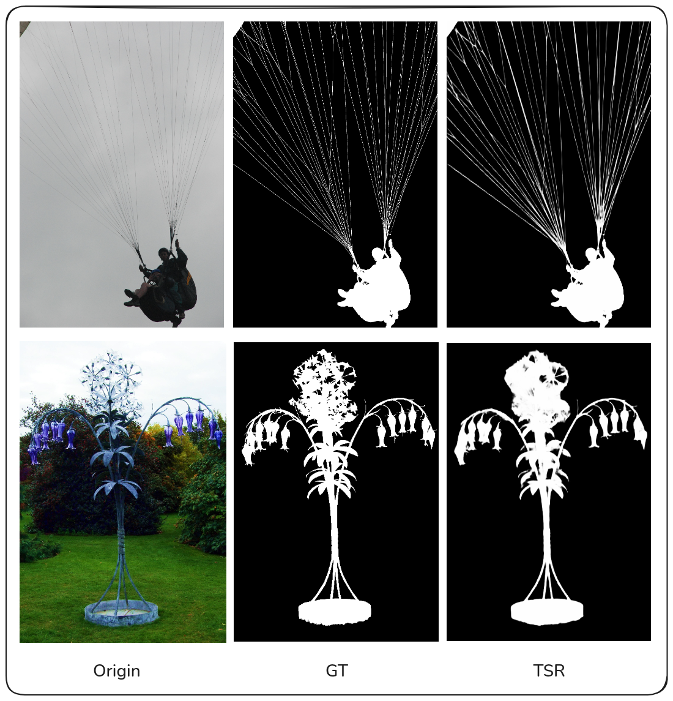
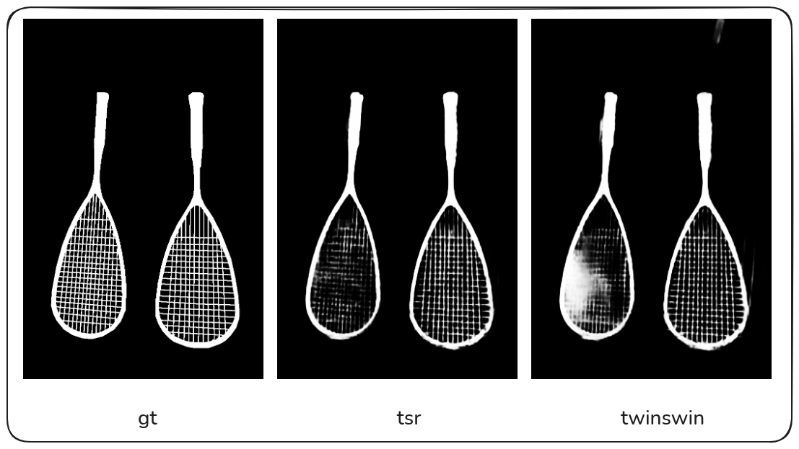

# TSR-Matte: Twin Swin Refiner Network for High-Resolution Image Matting

**TSR-Matte** (Twin-Swin-Refiner) is a high-performance image matting architecture designed to handle high-resolution inputs with precise edge details. It combines the semantic understanding of a **Swin Transformer** (Twin-Encoder) with a lightweight, high-resolution **Dilated Refiner**.



---
## Comparison: TwinSwin-Matte vs. TSR-Matte (Swin Tiny):



1. The MSE Dilution Effect (Global vs. Local) MSE calculates the average error across the entire image (over 1 million pixels for 1024x1024). Since 95% of the image (pure background and foreground) is predicted perfectly by both models, the significant improvement in the critical 5% (edges and hair details) gets "diluted" in the final average. A 0.002 difference in MSE actually represents a massive improvement in those specific edge regions.

2. Perceptual Quality vs. Numerical Safety The baseline TwinSwin tends to predict blurry edges to play it safe mathematically (minimizing variance). TSR-Matte, with its Refiner, forces sharp, high-frequency details. To the human eye, sharp hair looks much better (higher perceptual quality), even if the MSE penalty for a sharp edge is mathematically similar to a blurry one.

3. Overcoming Backbone Limitations Using Swin Tiny (a lightweight backbone) limits the model's ability to capture fine details on its own. The Residual Refiner in TSR-Matte successfully compensates for this, allowing a small backbone to produce SOTA-level fine details that usually require much larger models.

---

## 🌟 Key Features

1.  **Twin-Encoder Architecture**
    * **Student Encoder**: Learns from RGB images to predict the alpha matte.
    * **Teacher Encoder**: (Training phase only) Encodes Ground Truth masks to guide the student, ensuring faster and more stable convergence.
    * **Backbone**: Powered by `Swin Transformer`. Currently optimized for `Swin Tiny` (Testing) and `Swin Base` (Production).

2.  **Dilated Residual Refiner**
    * A dedicated, lightweight module taking **RGB + Gradient Map** as input.
    * Uses **Dilated Convolutions** (Inception-style) to capture multi-scale details without downsampling, maintaining full resolution.
    * Operates on **Residual Learning**: it predicts the *difference* ($\Delta$) to correct the coarse mask, rather than regenerating it.

3.  **Mask-Guided Attention**
    * Mathematically derived from the coarse mask uncertainty ($4 \cdot x \cdot (1-x)$).
    * Forces the Refiner to focus **only on the edges** (hair, fur, transparent boundaries) and suppresses noise in the pure background/foreground.

4.  **SOTA-Level Optimization**
    * **Smart Initialization**: Solves the "Cold Start" problem; the model performs as well as the backbone from Epoch 1.
    * **Gradient Loss**: Enforces sharp edge predictions.

---

## 🏗️ Architecture Overview

The following diagram illustrates the data flow in TSR-Matte:


---

## 🚀 Getting Started

### 1. Requirements

* Python 3.10+
* PyTorch 2.5+
* CUDA (Highly Recommended for training)

> **⚠️ Important**: Please check your CUDA version and install the compatible `torch` and `torchvision` versions from the [official PyTorch website](https://pytorch.org/get-started/locally/).

**Step 1: Install PyTorch (Example for CUDA 12.6)**
```bash
# Please visit pytorch.org to get the command matching your environment
pip3 install torch torchvision
```

**Step 2: Install other dependencies**

```bash
pip install timm opencv-python pillow tqdm matplotlib pandas
```

### 2. Dataset Preparation (DIS5K)

Please structure your dataset directory as follows:

```
Datasets/DIS5K_Flat/
├── train/
│   ├── im/  (Original Images .jpg/.png)
│   └── gt/  (Alpha Masks .png)
├── val/
│   ├── im/
│   └── gt/
```

### 3. Configuration

Edit config.py to select your backbone.

For Testing/Debugging: Use MODEL_IDX = 0 (Swin Tiny).
For SOTA Results: Use MODEL_IDX = 2 (Swin Base).

```python
# config.py

# ...
# 0=Tiny (Fast), 1=Small, 2=Base (Best Accuracy)
MODEL_IDX = 0  
# ...
```

---
## ⚡ Training

Run the training script. The model utilizes Smart Initialization, so the loss should decrease steadily right from the start without a warmup period.

```bash
python train.py
```

- Checkpoints: Saved in checkpoints/TSR-Matte_SwinTiny_...
- Logs: Training metrics (Loss, MSE, SAD, Grad) are saved to training_log.csv.

---
## 🎨 Inference (Prediction)

To generate alpha mattes for your own images:

Place test images in the test_data/ directory.
Run the prediction script:

```bash
python predict.py
```

Results (Alpha Matte) will be saved in test_results/.

---
## 📚 References & Acknowledgements

This project is built upon the insights and architectures of the following excellent works:

- [Swin Transformer](https://arxiv.org/pdf/2103.14030)
- [InSPyReNet](https://arxiv.org/pdf/2209.09475)
